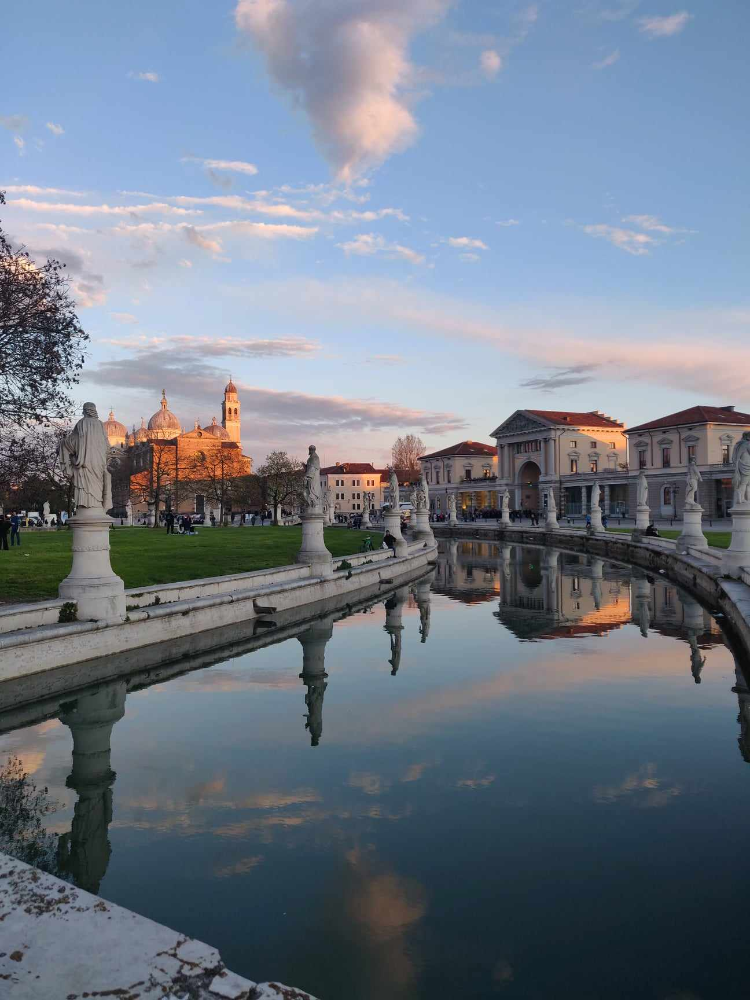

<br>
<br>
<button type="button" name="button" class="btn" style="background-color:white;color:blue;width: 32%;">[Main page](/index)</button>
<button type="button" name="button" class="btn" style="background-color:white;color:blue;width: 32%;">[Research](/Rmarkdowns/Research)</button>
<button type="button" name="button" class="btn" style="background-color:white;color:blue;width: 32%;">[Conferences and Talks](/Rmarkdowns/ConferencesAndTalks)</button>
</button>
<br>

***

<br>

<div style="text-align: right"> <p>&quot;<em>Questions? &quot; <br>&quot;When's Bart coming back?&quot;<br> &quot;He's not. He thought he was better than the laws of probability. <br>Anyone else think he's better than the laws of probability? <br>Well, you're not!</em>&quot; <br>MoneyBart, S22E03 - Lisa Simpson</p>
</div>
<div style="text-align: right">
</div>

<br>


# {.tabset .tabset-fade}


## Courses for the Academic Year 2024-2025

<br>

Docente di

* [Metodi Statistici per Big Data](https://didattica.unipd.it/off/2022/LT/SC/SC2095/000ZZ/SCP4063754/N0)
* [Big Data and Artificial Intelligence](https://didattica.unipd.it/off/2023/LM/EP/EP2731/000ZZ/EPQ4107100/N0)

Esercitatore per 

* Statistica Progredito

<div class="article-header">
  
</div>


   
<br>     
[**<**](/index)
 

## Past Courses

<br>

<div style="text-align: right"> <p>&quot;<em>Via il Denti, via il dolore</em>&quot; <br>LDA</p>
</div>

<br>

<br>

```{r, echo=F,message=FALSE,warning=F}
library(tidyverse)
library(kableExtra)
```

```{r,echo=F}
corsi <- tibble(`Degree type` =".", Course = "", Uni = ".", Role = "",`  Year` = ".", Hours = ".", Lang. = ".")

corsi = rbind(corsi,
              c("CostAction Tutorial","BNP Methods","King's College","PI", "2024", "13", "Eng"),
              c("co-taught with M. Guindani","","","","","",""),
              c("SumSc in Social Sciences","Bayesian Modelling","USI","PI", "2024", "40", "Eng"),
              c("MSc in Statistics","Advanced Statistical Inference","UniPD","TA", "23-24", "26", "Ita"),
              c("BSc in Statistics","Statistical Methods for Big Data","UniPD","TA", "23-24", "24", "Ita"),
              c("MSc in Data Analytics for Businness","Computational Statistics","Unicatt","PrI + TA", "22-23", "80", "Eng"),
              c("Master in DS4M","R for Data Science","Unicatt","PrI", "22-23", "7", "Eng"),
              c("Master in DS4M","Introduction to Statistics","Unicatt","PrI", "22-23", "14", "Eng"),
              c("BSc in Economics","Statistica","Unicatt","TA", "22-23", "24", "Ita"),
              c("MSc in Data Analysis for Businness","Computational Statistics","Unicatt","TA", "21-22", "20", "Eng"),
              c("MSc in Finance","Advanced Statistics","USI","TA", "19-20", "15", "Eng"),
              c("MSc in Finance", "Statistics","USI","TA", "18-19", "15", "Eng"),
              c("BSc in Economics", "Statistica","UniBocconi","TA", "17-18", "24", "Ita"),
              c("MSc in Finance", "Introduction to Statistics","Unicatt","PrI", "17-18", "15", "Eng"),
              c("BSc in Statistics", "Probability","Unimib","TA", "17-18", "34", "Ita"),
              c("BSc in Statistics", "Probability","Unimib","TA", "16-17", "34", "Ita"),
              c("BSc in Statistics", "Probability","Unimib","TA", "15-16", "34", "Ita"),
              c("MSc in Statistics", "Bayesian Statistics","Unimib","vTA", "16-17", "8", "Ita"))
             

kableExtra::kable_styling(kable(corsi[-1,])) %>% footnote(c("PI: Principal Instructor  -  SumS: Summer School  -  TA: Teaching Assistant  -  vTA: volounteer Teaching Assistant"))
```

<div class="article-header">
  
</div>


<!--
1. [Apr 19 – Jul 20] Lab instructor (20h), MSc course in **Computational Statistics** (Eng)  
@ *Università Cattolica del Sacro Cuore, Milan*  

1. [Sep 19 – Jan 20] Teaching Assistant, MSc course in **Advanced Statistics** (Eng)  
@ *USI - Universtà della Svizzera italiana*  

1. [Sep 18 – Jan 19] Teaching Assistant, MSc course in **Statistics** (Eng)  
@ *USI - Universtà della Svizzera italiana, Lugano*  

1. [Sep 17 – Jun 18] Teaching Assistant, BSc course in **Statistics** (Eng)  
@ *Bocconi University, Milan*  

1. [Sep 17] Principal Instructor, MSc precourse in **Statistics** (15h, Eng)  
@ *Università Cattolica del Sacro Cuore, Milan*  

1. [Nov 15 – Jan 21] Teaching Assistant and Academic Tutor, BSc course in **Probability** (Ita)  
@ *University of Milano-Bicocca*, Author of the course notes  

1. [Oct 16 – Dec 17] Volunteer Academic Tutor, MSc course in **Bayesian Statistics** (Ita)  
@  *University of Milano-Bicocca*
-->

# 

---
   
<br>
<br>
<button type="button" name="button" class="btn" style="background-color:white;color:blue;width: 32%;">[Main page](/index)</button>
<button type="button" name="button" class="btn" style="background-color:white;color:blue;width: 32%;">[Research](/Rmarkdowns/Research)</button>
<button type="button" name="button" class="btn" style="background-color:white;color:blue;width: 32%;">[Conferences and Talks](/Rmarkdowns/ConferencesAndTalks)</button>
</button>
<br>
<br>
