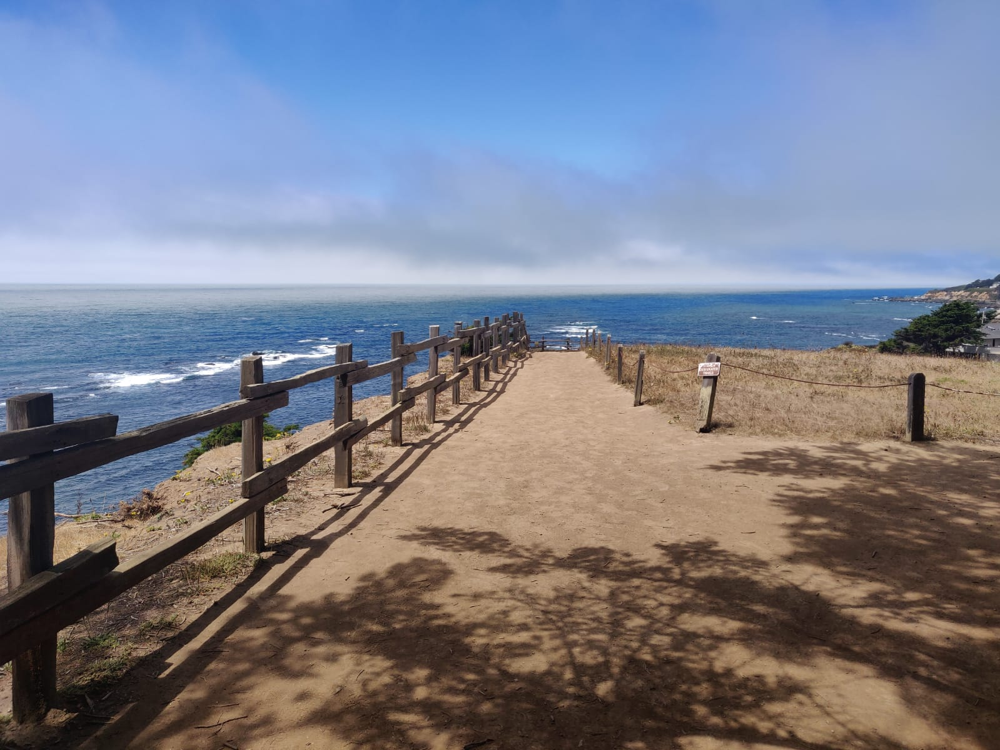
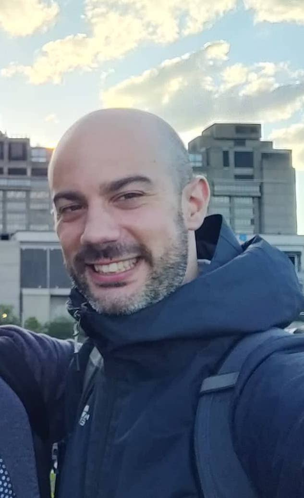

 
 
<button type="button" name="button" class="btn" style="background-color:white;color:blue;width: 32%;">[Research](/Rmarkdowns/Research)</button>
<button type="button" name="button" class="btn" style="background-color:white;color:blue;width: 32%;">[Presentations](/Rmarkdowns/ConferencesAndTalks)</button>
<button type="button" name="button" class="btn" style="background-color:white;color:blue;width: 32%;">[Teaching](/Rmarkdowns/Teaching)
</button>

 
 

 

&quot;<em>The writer Umberto Eco belongs to that small class of scholars who are encyclopedic, insightful, and nondull. He is the owner of a large personal library (containing thirty thousand books), and separates visitors into two categories: those who react with “Wow! Signore, professore dottore Eco, what a library you have ! How many of these books have you read?” and the others - a very small minority - who get the point that a private library is not an ego-boosting appendage but a research tool.  Read books are far less valuable than unread ones.</em>&quot;   The Black Swan - N. N. Taleb

 
 

  

 

  
  
  

  

### About (the academic) me
  
---

 

I am an Assistant Professor (RtdA) at the [Department of Statistics of Università Cattolica del Sacro Cuore - Milan](https://dipartimenti.unicatt.it/scienze_statistiche).  

Previously, I spent two years as a Postdoctoral Scholar at the [Department of Statistics of Univerisity of California - Irvine](https://www.stat.uci.edu/) (UCI), working under the supervision of Professor [Babak Shahbaba](https://www.ics.uci.edu/~babaks/).  

Before joining UCI, I obtained a Ph.D. in Statistics at University of Milan - Bicocca and Università della Svizzera italiana (joint program, awarded with honors) working with Professor [Antonietta Mira](https://search.usi.ch/en/people/f8960de6d60dd08a79b6c1eb20b7442b/mira-antonietta) and Professor [Michele Guindani](https://www.micheleguindani.info).  

I am interested in Bayesian mixtures, Bayesian nonparametrics, model-based clustering, shrinkage priors, and dimensionality reduction.  

 
 
 
 
<button type="button" name="button" class="btn" style="background-color:white;color:blue;width: 32%;">[Research](/Rmarkdowns/Research)</button>
<button type="button" name="button" class="btn" style="background-color:white;color:blue;width: 32%;">[Presentations](/Rmarkdowns/ConferencesAndTalks)</button>
<button type="button" name="button" class="btn" style="background-color:white;color:blue;width: 32%;">[Teaching](/Rmarkdowns/Teaching)
</button>
 
 

#### Other useful links

 
<button type="button" name="button" class="btn" style="background-color:white;color:blue;width: 48%;">[Google Scholar Profile](https://scholar.google.it/citations?hl=it&user=8WqmGiEAAAAJ)</button>
<button type="button" name="button" class="btn" style="background-color:white;color:blue;width: 48%;">[Github Profile](https://github.com/Fradenti)</button>  
<button type="button" name="button" class="btn btn" style="background-color:white;color:blue;width: 48%;">[ArXiv](https://arxiv.org/search/?searchtype=author&query=Denti%2C+F)</button>
<button type="button" name="button" class="btn" style="background-color:white;color:blue;width: 48%;">[ResearchGate](https://www.researchgate.net/profile/Francesco-Denti-2)</button>

  

### News and highlights

---  

[2023/01/11] One of my postdoc projects, the *Horseshoe mixture model*, got accepted on **AOAS**!  
[2022/09/15] Our paper on *Generalized Ratios ID* estimation got accepted for publication on **Scientific Reports**!    
[2022/03/01] Our *collaborative paper* got accepted for publication on **Appetite**!  
[2022/03/01] I joined the Department of Statistics at Università Cattolica del Sacro Cuore - Milan as an Assistant Professor (RtdA)

  

### Misc

---

<button type="button" name="button" class="btn" style="background-color:white;color:blue;width: 50%;">[My second family (in italian)](http://www.compagniameteor.it/)</button>

  

### Contacts

---

**Email**: francesco.denti@unicatt.it

