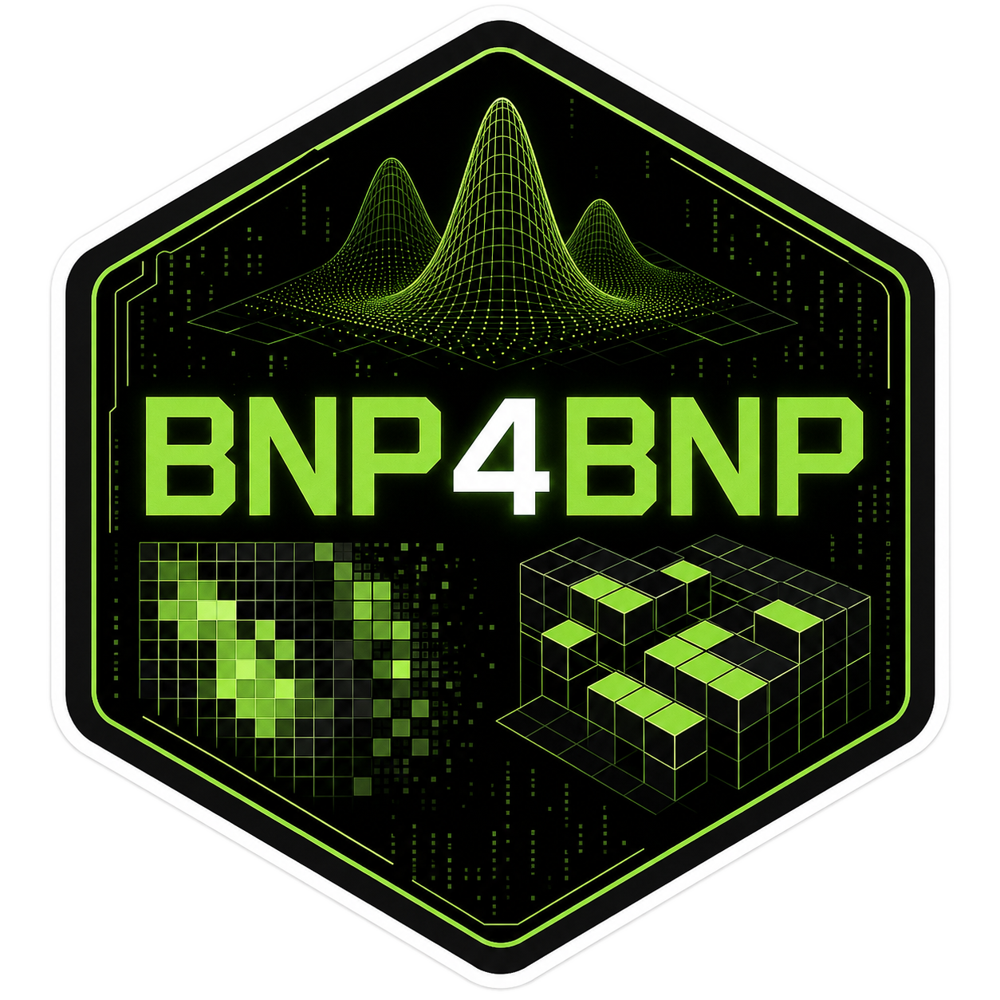

# Page under construction

## BNP4BNP – Bayesian Non Parametrics for Biclustering and Nested Partitions

**Role:** Principal investigator

**Starting date:** May 2026

**Funder:** project funded by the STARS@UNIPD 2025 call, with the support of Fondazione Cassa di Risparmio di Padova e Rovigo

**Objectives:** 

Modern datasets often have complex structures that change across space, time, and experimental conditions. These complexities create challenges for traditional statistical methods. This project develops advanced statistical models that segment data into meaningful groups. These models reveal simple, interpretable patterns in large, high-dimensional datasets.

The proposed approach uses flexible Bayesian nonparametric models tailored to structured data. Such data include grouped observations or arrangements in matrix form. Examples are measurements collected across multiple locations and features. These models capture dependencies within and across groups. They also preserve the contextual information essential for scientific interpretation.

The methodology is motivated by compelling real-world applications. One example is analyzing brain imaging data to uncover shared patterns of neural activity. Another is the study of complex molecular data from modern imaging technologies, aimed at detecting underlying spatial and biochemical structures. While inspired by these applications, the proposed models are broadly applicable to a wide range of scientific domains that face similar data challenges.

A central objective of the project is to bridge theory and practice. The project pairs methodological advances with tangible impact. This includes developing open-source software to ensure the methods are accessible and usable by the broader research community.

### Publications

- Hopefully coming soon